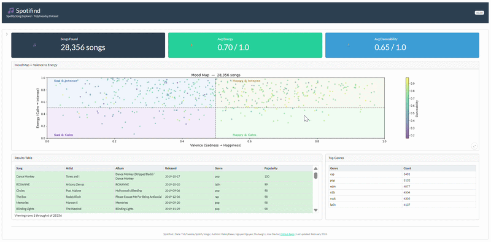

# Spotifind

## **Users**

Spotifind is a dashboard that lets users search for music using Spotify's audio features instead of just genres. Users can filter songs by features like energy level, danceability, tempo, and mood (called "valence" in the data). Especially useful for people who are interested in the technical side of music, such as DJs or sound technicians.



The main dashboard can be accessed [here](https://019c9734-80f7-7726-68c1-3f657d071b93.share.connect.posit.cloud/)

## **Contributors**

Rahiq Raees, Nguyen Nguyen, Shuhang Li, Jose Davila

As the dashboard is being developed, a live preview for developers can be accessed [here](https://019c9738-9c84-097d-6189-117642c8821f.share.connect.posit.cloud/)

If you are interested in contributing to this dashboard, please review the [CONTRIBUTING.md](CONTRIBUTING.md) document for more information.

## Running Tests

This project have 2 type of tests:
- **Unit test** - `test_filter_songs.py` - test the filtering logic, make sure it works even in edge cases. 
- **Playwright test** - `test_app.py` - test the dashboard UI by simulate real interaction like using slider, filter genre, click reset.

Guide on how to run the test:

1. Set up envrionment

```
conda env create -f environment.yml
conda activate spotifind
```
OR:

```
pip install -r requirements.txt
```

2. Install Playwright

```
playwright install chromium
```

3. Run tests

Only unit-test:
```
pytest tests/test_filter_songs.py
```

Only playwright test:
```
pytest tests/test_app.py
```

All tests:
```
pytest tests/
```


## Dataset Acknowledgement

This project was developed using the following dataset:
- Dataset name: [Spotify Songs](https://github.com/rfordatascience/tidytuesday/blob/main/data/2020/2020-01-21/readme.md)
- License: MIT

## Code of Conduct

Please note that this project is released with a [Code of Conduct](CODE_OF_CONDUCT.md). By participating in this project you agree to abide by its terms.

## License

This project is licensed under the MIT License, please see [LICENSE](LICENSE) file for details.

## Citation

If you wish to use this app anywhere, please cite as the following:
Raess, R., Nguyen, N., & Li, S., Davila, J. (2026) Spotifind.

