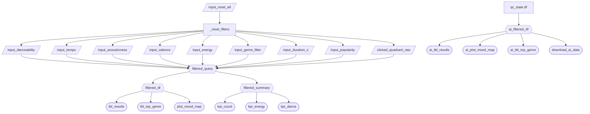

# App Specification

## 2.1 Updated Job Stories

| #   | Job Story                       | Status         | Notes                         |
| --- | ------------------------------- | -------------- | ----------------------------- |
| 1   | When Alex prepares a playlist for his gym morning class on Saturdays, he needs to select the first 15 songs with energy > 0.85 and tempo 135-155 BPM, which allows him to complete the selection within 20 minutes. | ✅ Implemented | Energy and tempo sliders filter songs; results table shows matching songs |
| 2   | When Alex creates a 'Late Night Focused Study' playlist for clients, he needs to filter 10 songs with a valence < 0.3, acoustics > 0.7, and duration < 240 seconds, so that clients receive the perfect study tracks. | ✅ Implemented | Valence, acousticness, and duration sliders all implemented |
| 3   | When Alex wants to discover new songs for the dance floor, he needs to look at scatter plots of songs with danceability > 0.8 but popularity < 0.2, so that he can find hidden potential songs that are not yet popular but are suitable for parties, thus improving his reputation. | 🔄 Revised | Danceability and popularity sliders implemented; mood map replaces scatter plot as the primary visual discovery tool. Quadrant click interaction added in M4 allows direct filtering by mood region. |

---

## 2.2 Component Inventory

| ID                   | Type          | Shiny widget / renderer | Depends on                                                              | Job story  |
| -------------------- | ------------- | ----------------------- | ----------------------------------------------------------------------- | ---------- |
| `input_danceability` | Input         | `ui.input_slider()`     | —                                                                       | #3         |
| `input_tempo`        | Input         | `ui.input_slider()`     | —                                                                       | #1         |
| `input_acousticness` | Input         | `ui.input_slider()`     | —                                                                       | #2         |
| `input_valence`      | Input         | `ui.input_slider()`     | —                                                                       | #2         |
| `input_energy`       | Input         | `ui.input_slider()`     | —                                                                       | #1         |
| `input_duration_s`   | Input         | `ui.input_slider()`     | —                                                                       | #2         |
| `input_popularity`   | Input         | `ui.input_slider()`     | —                                                                       | #3         |
| `input_genre_filter` | Input         | `ui.input_select()`     | —                                                                       | #1, #2, #3 |
| `clicked_quadrant_raw` | Input       | `ui.input_text()` (hidden) | JS click event on mood map                                           | #3         |
| `filtered_query`     | Reactive calc | `@reactive.calc`        | all inputs + `clicked_quadrant_raw` | #1, #2, #3 |
| `filtered_df`        | Reactive calc | `@reactive.calc`        | `filtered_query`                                                        | #1, #2, #3 |
| `filtered_summary`   | Reactive calc | `@reactive.calc`        | `filtered_query`                                                        | #1, #2, #3 |
| `kpi_count`          | Output        | `@render.text`          | `filtered_summary`                                                      | #1, #2, #3 |
| `kpi_energy`         | Output        | `@render.text`          | `filtered_summary`                                                      | #1         |
| `kpi_dance`          | Output        | `@render.text`          | `filtered_summary`                                                      | #3         |
| `plot_mood_map`      | Output        | `@render.ui`            | `filtered_df`, `clicked_quadrant`                                       | #2, #3     |
| `tbl_results`        | Output        | `@render.data_frame`    | `filtered_df`                                                           | #1, #2     |
| `tbl_top_genre`      | Output        | `@render.plot`          | `filtered_df`                                                           | #1, #2, #3 |
| `ai_filtered_df`     | Reactive calc | `@reactive.calc`        | `qc_state.df()`                                                         | #1, #2, #3 |
| `ai_tbl_results`     | Output        | `@render.data_frame`    | `ai_filtered_df`                                                        | #1, #2, #3 |
| `ai_plot_mood_map`   | Output        | `@render.ui`            | `ai_filtered_df`                                                        | #2, #3     |
| `ai_tbl_top_genre`   | Output        | `@render.plot`          | `ai_filtered_df`                                                        | #1, #2, #3 |
| `download_ai_data`   | Output        | `@render.download`      | `ai_filtered_df`                                                        | #1, #2, #3 |

---

## 2.3 Reactivity Diagram

---

## 2.4 Calculation Details

### `filtered_query`

- **Depends on:** all slider inputs, `input_genre_filter`, `clicked_quadrant_raw`
- **Transformation:** Constructs a lazy DuckDB/ibis query filtering the parquet dataset to rows matching all slider ranges. If a genre is selected, adds a genre equality filter. If a mood quadrant is selected via click, adds valence and energy range filters for that quadrant. No data is pulled into memory at this stage.
- **Consumed by:** `filtered_df`, `filtered_summary`

### `filtered_df`

- **Depends on:** `filtered_query`
- **Transformation:** Executes the lazy query and materializes the result as a pandas DataFrame via `.to_pandas()`.
- **Consumed by:** `plot_mood_map`, `tbl_results`, `tbl_top_genre`

### `filtered_summary`

- **Depends on:** `filtered_query`
- **Transformation:** Executes a DuckDB aggregation query returning row count, average energy, and average danceability. Only three scalar values are pulled into memory, avoiding full materialization for KPI updates.
- **Consumed by:** `kpi_count`, `kpi_energy`, `kpi_dance`

### `ai_filtered_df`

- **Depends on:** `qc_state.df()`
- **Transformation:** Returns the pandas DataFrame produced by querychat based on the user's natural language query.
- **Consumed by:** `ai_tbl_results`, `ai_plot_mood_map`, `ai_tbl_top_genre`, `download_ai_data`

---

## M4 Changes

### Performance: Parquet + DuckDB

The data layer was switched from loading a CSV into a pandas DataFrame at startup to reading a parquet file via ibis + DuckDB. All filtering now happens as lazy queries at the database level before any data enters memory. A separate `filtered_summary` reactive calc runs a DuckDB aggregation for KPI values, avoiding full DataFrame materialization on every filter change.

### Advanced Feature: Option D — Component Click Interaction

The Mood Map was extended to act as an input component in addition to an output. Clicking on any of the four quadrant regions (Sad & Intense, Happy & Intense, Sad & Calm, Happy & Calm) filters the entire dashboard to songs in that mood region. The click is captured via a Plotly `plotly_click` JavaScript event listener that writes the selected quadrant name into a hidden `ui.input_text`, which Shiny then picks up as a reactive input. Clicking the same quadrant again deselects it. A badge in the sidebar and a checkmark on the map indicate the active quadrant. This was chosen over the other options because it directly enhances the primary visual discovery use case (Job Story #3) without requiring external services or additional API costs.

### Feedback Addressed (M4)

The following items from the M4 Feedback Prioritization issue (#57) were resolved this milestone:

| Item | Source | PR |
| ---- | ------ | -- |
| Mood Map color gradient pins to unfiltered min/max danceability | Tiantong Yin (Critical) | #59 |
| AI tab chat scrolls independently from page | Daniel (Critical) | #60 |
| Mood Map quadrant labels misaligned on right side; whitespace below chart | Diana Cornescu | #61 |
| Avg Energy and Avg Danceability displayed as percentages | Tiantong Yin | #62 |
| Test UI results updated to percentage format | Nguyen | #67 |
| AI Explorer filtered table displayed before visualizations | Diana Cornescu | #69 |
| Dataframe fills the full card width | Daniel | #71 |

---

## M2 Complexity Enhancement

**Feature: Reset Button**

A "Reset Filters" button was added to the bottom of the sidebar using `@reactive.effect` + `@reactive.event(input.reset_all)`. When clicked, it restores all 7 sliders and the genre dropdown to their default values using `ui.update_slider()` and `ui.update_select()`.

**Why it improves UX:** After applying multiple narrow filters, users have no easy way to return to the full dataset view. The reset button solves this in one click, without requiring the user to manually drag each slider back. This directly supports all three job stories since Alex can quickly switch between building different playlist types without residual filters from a previous search interfering.